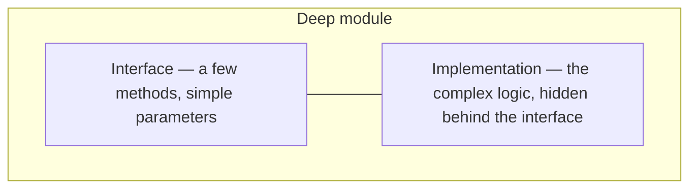
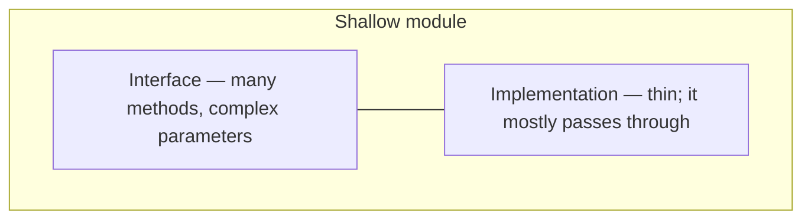

# Deep Modules

From "A Philosophy of Software Design":

**Deep module** = small interface + lots of implementation

**Shallow module** = large interface + little implementation (avoid)

The picture to hold: a deep module is a narrow top over a tall body, a
shallow one is a wide top over almost nothing. Callers pay for the width of
the top on every use; maintainers get the height of the body as locality.

When designing interfaces, ask:

- Can I reduce the number of methods?
- Can I simplify the parameters?
- Can I hide more complexity inside?
